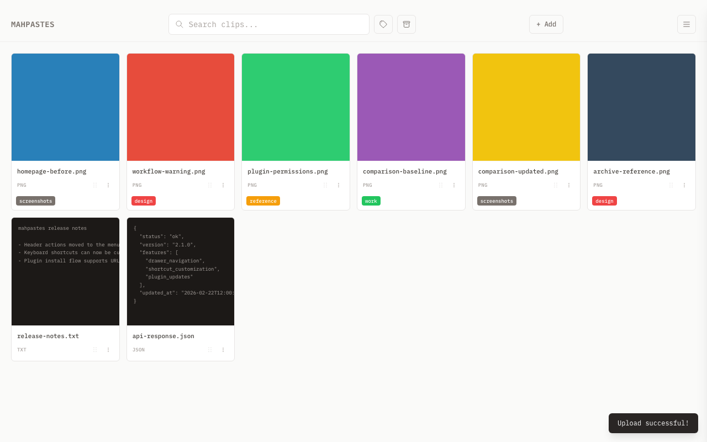

# mahpastes

A local clipboard manager for macOS, Windows, and Linux. Store, organize, and quickly access your copied content.




Documentation: https://egeozcan.github.io/mahpastes/

## Features

- **Paste Anything** — Images, text, code, JSON, HTML, and files (paste or drag & drop)
- **Fast Navigation** — Keyboard-first workflow with drawer + modal shortcuts and a built-in cheatsheet (`?`)
- **Custom Shortcuts** — Rebind key mappings from **Settings > Shortcuts**
- **Archive** — Keep important clips separate from your active workspace
- **Tags** — Tag clips, filter by tag, and hide noisy tags from default gallery view
- **Image Editor** — Annotate images with brush, shapes, and text tools
- **Text Editor** — Edit text and code clips directly
- **Image Comparison** — Compare two images with fade, slider, or diff modes
- **Bulk Actions** — Select multiple clips to tag, archive, download, or delete
- **Search** — Filter clips by filename or type
- **Watch Folders** — Auto-import files from monitored directories
- **Plugin System** — Install and manage Lua plugins from the dedicated Plugins modal
- **Backup & Restore** — Export and import all data as a ZIP archive
- **Copy Path** — Create a temp file and copy its path to clipboard
- **Export** — Save individual clips or download multiple as a ZIP
- **Auto-Delete Engine** — Backend expiration support is implemented; per-clip expiration controls are being surfaced in UI

## Installation

### Download Release

Download the latest release from the [Releases](https://github.com/egeozcan/mahpastes/releases) page.

### Build from Source

#### Prerequisites

- [Go](https://go.dev/dl/) 1.24+
- [Wails CLI](https://wails.io/docs/gettingstarted/installation)
- [Node.js](https://nodejs.org/) 18+

```bash
# Install Wails CLI
go install github.com/wailsapp/wails/v2/cmd/wails@latest
```

#### Build

```bash
# Clone the repository
git clone https://github.com/egeozcan/mahpastes.git
cd mahpastes

# Build for your platform
wails build

# The app will be in build/bin/
```

#### Platform-specific builds

```bash
# macOS (Universal - Intel + Apple Silicon)
wails build -platform darwin/universal

# Windows
wails build -platform windows/amd64

# Linux
wails build -platform linux/amd64
```

### Install on macOS

After building, copy to Applications:

```bash
cp -R build/bin/mahpastes.app /Applications/
```

## Development

```bash
# Install dependencies
cd frontend && npm install && cd ..

# Run in development mode
wails dev
```

The app will open and hot-reload when you make changes to the frontend.

A `Makefile` provides shortcuts for common operations:

```bash
make dev        # Start dev server with hot reload
make build      # Clean production build
make install    # Build, kill running app, install to /Applications, launch
make test       # Run e2e tests
make screenshots # Refresh documentation screenshots
make help       # Show all targets
```

### Project Structure

```
mahpastes/
├── main.go             # App entry point
├── app.go              # Core application logic and API
├── backup.go           # ZIP backup and restore
├── database.go         # SQLite database setup and cleanup
├── plugin_service.go   # Plugin frontend API
├── plugins.go          # Plugin install/uninstall helpers
├── watcher.go          # Watch folder implementation
├── Makefile            # Build, install, test targets
├── wails.json          # Wails configuration
├── plugin/             # Lua plugin system
├── plugins/            # Bundled example plugins
├── build/              # Build assets and output
│   ├── appicon.png
│   └── bin/            # Built binaries
├── frontend/
│   ├── index.html      # Main UI
│   ├── css/            # Stylesheets
│   ├── js/             # JavaScript modules
│   └── tailwind.config.js
└── e2e/                # Playwright e2e tests
```

### Frontend Stack

- Vanilla JavaScript (no framework)
- Tailwind CSS
- IBM Plex Mono font

### Backend

- Go with Wails v2
- SQLite database (WAL mode)
- System clipboard integration via `golang.design/x/clipboard`

## Data Storage

Data is stored in platform-specific locations:

| Platform | Location |
|----------|----------|
| macOS    | `~/Library/Application Support/mahpastes/` |
| Windows  | `%APPDATA%\mahpastes\` |
| Linux    | `~/.config/mahpastes/` |

The database file is `clips.db`. Temporary files are stored in `clip_temp_files/` and cleaned up on app exit.

## Keyboard Shortcuts

Shortcuts are configurable from **Settings > Shortcuts**.

| Shortcut | Action |
|----------|--------|
| `?` | Open keyboard shortcut cheatsheet |
| `M` | Open menu drawer |
| `,` | Open settings |
| `P` | Open plugins |
| `A` | Toggle archive view |
| `W` | Open watch view |
| `/` | Focus search |
| `Cmd/Ctrl + V` | Paste from clipboard |
| `Escape` | Close modal, drawer, or cheatsheet |

### Image Editor

| Shortcut | Tool |
|----------|------|
| `B` | Brush |
| `L` | Line |
| `R` | Rectangle |
| `C` | Circle |
| `T` | Text |
| `E` | Eraser |
| `Cmd/Ctrl + Z` | Undo |
| `Cmd/Ctrl + Y` | Redo |

Full shortcut reference: https://egeozcan.github.io/mahpastes/getting-started/keyboard-shortcuts

## License

MIT
