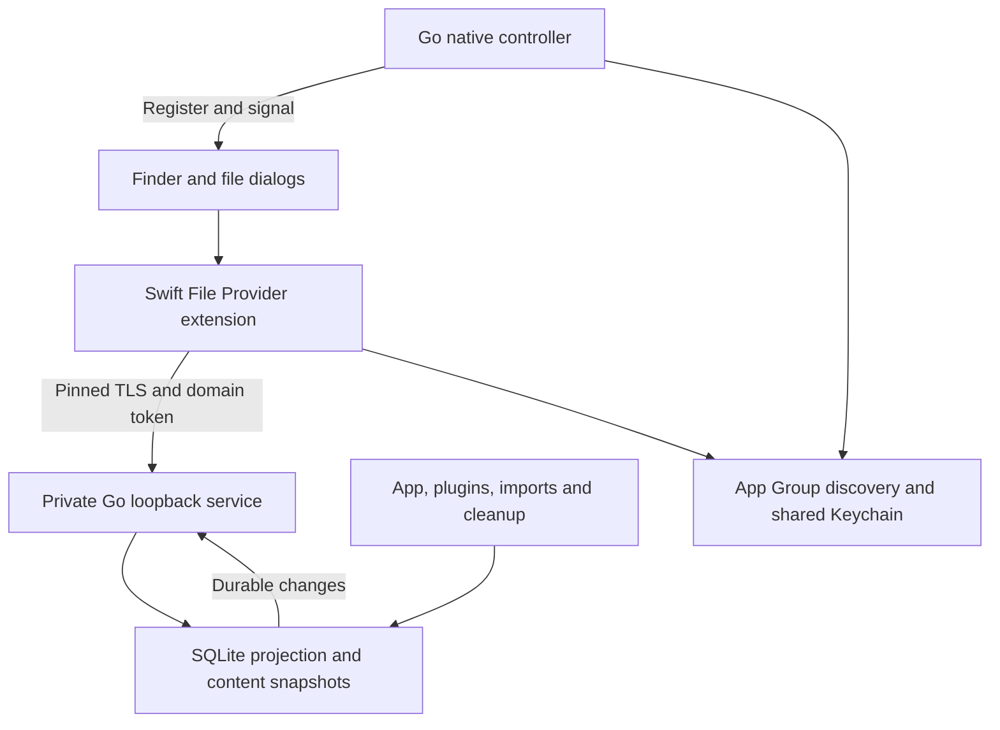

# macOS Finder access

This implements phase R of the File Provider integration: a read-only Finder
location containing Active and Archive. Users can open, preview and copy clips
using Finder, Terminal and file dialogs. Changes still happen in Mahpastes.
The system controls download indicators and local materialization; this feature
does not add cloud storage or cross-device synchronization.

The integration is opt-in at build time and in Settings. The native variant
requires macOS 13 or later. Ordinary desktop builds, binding generation, `mp`
and `mahpastesd` do not require Swift, Xcode or Apple signing credentials.

## Build and install

The native build needs Xcode with its command-line tools selected, XcodeGen,
the Go toolchain specified by `go.mod`, Node, and Wails v2.12.0. The Xcode project
is generated from `native/macos/project.yml` into `build/file-provider`.

To compile the host and extension without signing:

```sh
go install github.com/wailsapp/wails/v2/cmd/wails@v2.12.0
brew install xcodegen
bash scripts/macos/build-file-provider.sh --unsigned
```

This creates a universal `build/bin/mahpastes.app` with
`Contents/PlugIns/MahpastesFileProvider.appex`. An unsigned build is a compile
artifact; it is not evidence that macOS will register or launch the provider.

For a functional signed bundle, configure these environment variables:

| Variable | Meaning |
| --- | --- |
| `TEAM_ID` | Apple developer team that signs both host and extension |
| `SIGN_IDENTITY` | Developer ID Application identity installed in the Keychain |
| `FP_BUNDLE_ID` | Host bundle ID; defaults to `io.github.egeozcan.mahpastes` |
| `FP_APP_GROUP` | Shared container; defaults to `TEAM_ID.io.github.egeozcan.mahpastes` |
| `FP_KEYCHAIN_GROUP` | Shared Keychain group; defaults to `TEAM_ID.io.github.egeozcan.mahpastes.fileprovider` |
| `HOST_PROFILE_PATH` | Host provisioning profile, when required by the selected capabilities/signing setup |
| `EXTENSION_PROFILE_PATH` | Extension provisioning profile with the corresponding app identifier and groups |
| `NOTARY_PROFILE` | Optional `notarytool` Keychain profile; enables notarization, stapling and Gatekeeper assessment |

Register the corresponding host and `.FileProvider` extension identifiers and
configure matching App Group and Keychain access capabilities in the Apple
developer account. The selected identities/profiles must authorize the exact
entitlements generated by the script. Keep these identifiers stable across
upgrades. The host remains nonsandboxed; only the extension is sandboxed.

```sh
make build-file-provider
```

The script builds and embeds the extension, checks both architecture slices,
finalizes Info.plists and provisioning profiles, signs the extension, then signs
the host. It does not automatically replace an installed app or register a
domain. Install the signed, notarized bundle in Applications and launch it from
there, then use **Settings > Finder access > Enable Finder access**. If macOS
requests extension approval, grant it in System Settings and use Retry.

Use a separate data directory (`MAHPASTES_DATA_DIR`) for development. The
per-directory single-instance lock remains authoritative; do not run the desktop
app and headless server against the same database simultaneously.

### Build in CI and sign locally without Xcode

The native CI job uploads `mahpastes-file-provider-unsigned-<build-sha>` after its
checks pass. It contains a ZIP made with `ditto` to preserve bundle permissions.
Use the artifact and signing script from the same trusted PR run. The artifact
suffix is the workflow checkout SHA (the merge commit for pull-request runs).
Download it with `gh run download <run-id> -n <artifact-name>`.
Extract it into the checkout's `build/bin` directory:

```sh
mkdir -p build/bin
ditto -x -k mahpastes-unsigned.zip build/bin
# Set TEAM_ID, SIGN_IDENTITY and the provisioning profile paths above first.
bash scripts/macos/build-file-provider.sh --sign-existing
```

This mode updates both bundles' identifiers and shared-group configuration for
your team, generates matching entitlements, and signs the extension and host.
It requires macOS command-line tools and Python 3, but does not run Xcode, Wails,
Go, or Swift compilation. Your signing private key stays in the local Keychain.
Provisioning and signed runtime acceptance are still required. Notarization is
optional in this command and requires `notarytool`/`stapler` when enabled.

Normal `make build`, release-tag workflows and installations remain unchanged.
The native build is not automatically added to public release assets until the
signed acceptance checks below are complete.

## Behavior

* Active and Archive are the only folders. A clip has one canonical parent and
  keeps its item identifier when renamed, edited or archived in the app.
* Names preserve a sanitized original name and append a full persistent UUID
  before the extension. The suffix keeps duplicate names stable on
  case-insensitive and Unicode-normalizing filesystems. Nameless clips receive
  a MIME-derived extension. Finder names do not replace app filenames.
* Clips assigned a hidden tag, including descendants of hidden tags, are
  excluded. Expired clips are excluded even before the cleanup job deletes them.
* Hiding, expiry and deletion cannot revoke downloaded or separately copied
  bytes. The Settings explanation makes this limitation explicit.
* The app must be running to enumerate or fetch uncached content. Quit retains
  the registered domain. Offline operations return `serverUnreachable`; they do
  not pretend the entire dataset was deleted. Cached availability is controlled
  by macOS. Relaunch publishes a new endpoint and signals the same domain.
* Disable removes the domain using `preserveDownloadedUserData` and displays any
  recovery path returned by macOS. A failed removal keeps the service running.
* Finder writes, imports, renames, moves, trash and deletion are not advertised;
  required mutation callbacks return a read-only error. Archive is not Trash.

## Architecture and platform boundary



`internal/fileprovider` contains the portable store and transport. It imports no
Wails or Apple APIs. `internal/fpnative` is the only new cgo boundary:

```text
real: darwin && cgo && fileprovider && !bindings
stub: !darwin || !cgo || !fileprovider || bindings
```

Both the Go bridge and Objective-C implementation have this constraint. The
bound `FileProviderService` has the same Status/Enable/Disable/Reveal methods in
all desktop builds. Unsupported builds report no capability and the frontend
hides the controls. The headless adapter has no provider service.

The extension has no access to `clips.db` or the app's leased export files. The
existing public API can be disabled or configured independently. The native
controller only manages domains, shared container access and Keychain access;
clip bytes do not cross cgo.

## Persistent tracking and restore

Tracking is installed only on first enrollment, using a checked transaction.
The auxiliary `fp_*` tables are not exported in backups. Once present, SQLite
triggers continue tracking mutations in ordinary/non-native builds so later
re-enrollment catches up without changing clip identity.

| Table | Purpose |
| --- | --- |
| `fp_state` | Schema version and dataset epoch |
| `fp_sources` | Clip UUID, content/metadata revisions and modification time |
| `fp_dirty` | Coalesced numeric clip IDs awaiting projection |
| `fp_items` | Current visible metadata and canonical parent |
| `fp_changes` | Sequence-numbered immutable metadata updates and tombstones |
| `fp_snapshots` | Enumeration scope, epoch, high-water mark and expiry |
| `fp_snapshot_items` | Frozen enumeration metadata, never file blobs |

Triggers cover inserts, updates and deletes on `clips`, tag assignment/hierarchy
changes and hidden-tag settings changes. They increment revisions and enqueue
work in the writer's own transaction. Existing `content_hash` is not trusted as
a version because some direct SQL writers do not update it. Rolled-back writes
leave no revisions or change events.

The worker polls once per second, handling at most 256 dirty IDs per write
transaction. Projection changes, immutable journal events and dirty consumption
commit atomically. Queries also catch up before enumeration/change reads.
Notifications signal root, Active, Archive and the working set; they are hints,
not the source of truth.

Successful restore rotates the dataset epoch and reconstructs source UUIDs in
the restore transaction. Old identifiers cannot resolve to restored numeric
IDs. Old pages and anchors expire. Normal delete/reinsert also gets a new UUID,
including explicit reuse of a numeric primary key. A failed restore leaves the
existing projection and identifiers intact.

## Protocol

Protocol version 1 is a private GET-only service on an ephemeral IPv4 loopback
HTTPS port. Every request includes a domain query parameter and a separate
Keychain bearer credential. Requests with an Origin header are rejected. No
CORS access is granted and mutating methods return HTTP 405.

The App Group contains an atomically replaced `provider-DOMAIN.json` discovery
file with protocol version, domain, endpoint and SHA-256 certificate fingerprint.
It contains no credential. Both processes explicitly use the macOS Data
Protection Keychain so the shared access-group entitlement applies. The extension verifies the pinned certificate before
sending the token, disables proxies/cookies/caches, refuses redirects and reloads
discovery for each operation. The certificate is regenerated on process restart.

| Endpoint | Query parameters | Result |
| --- | --- | --- |
| `/v1/item` | `domain`, `id` | Current visible metadata |
| `/v1/enumerate` | `domain`, `scope`, optional `page` | Frozen metadata page and snapshot anchor |
| `/v1/anchor` | `domain`, `scope` | Opaque current sync anchor |
| `/v1/changes` | `domain`, `scope`, `anchor` | Updates, tombstones and next anchor |
| `/v1/content` | `domain`, `id`, optional `version` | Binary bytes and matching metadata header |

Scopes are `root`, `active`, `archive`, `working`. Pages contain at most 200
items. Initial enumeration materializes a metadata snapshot in SQLite, then
closes the transaction before Finder requests another page. Snapshots expire
after ten minutes; at most 64 snapshots are retained. The Swift enumerator captures its baseline anchor before
creating that snapshot, so concurrent anchor/enumeration callbacks cannot skip
changes. Duplicate delivery can happen and is safe.

Change cursors include epoch, scope, sequence and a fixed upper sequence during
pagination. A page reads the historical metadata serialized with each event,
not newer `fp_items` rows. Multiple events for one item in a page are coalesced
to its last state. Moves delete the item from its former folder and update it in
the new folder; the working set sees an update. Journal retention is bounded to
roughly 100,000 events and 30 days. Stale tokens explicitly expire, triggering
re-enumeration instead of silently dropping changes.

Content reads validate identifier, current visibility and requested content
revision in the same read transaction used for all 1 MiB blob chunks. Obsolete
versions return `versionNoLongerAvailable`. Missing/deleted items return
`noSuchItem`. Outages return `serverUnreachable`. A short stream aborts the HTTP
response. The service admits at most four simultaneous requests.

The Swift client uses download tasks, verifies returned identity, revision and
byte count, then copies into `NSFileProviderManager.temporaryDirectoryURL()` on
the correct volume. Success transfers the staged file to macOS. Failure or
cancellation deletes the staging file. Progress cancellation cancels the task;
each required callback completes once.

## Tests and rollout gates

Portable tests cover direct SQL revisions, hidden descendants, archive moves,
expiry, multi-chunk concurrent edits, initial and incremental pagination,
historical journal metadata, rollback, restart tracking, restoration, numeric ID
reuse, token scope/expiry, authentication, binary transport and Unicode names.
The existing Go app/plugin/CLI tests are also run. A small pre-existing mDNS
typed-nil shutdown bug was fixed because it prevented the suite from completing
on hosts where multicast discovery cannot start.

```sh
go test -race ./internal/fileprovider ./internal/fpnative
go test ./internal/... ./plugin/... ./cmd/...
go test -tags bindings .
go test -tags 'fileprovider bindings' ./internal/fpnative
CGO_ENABLED=0 go test -tags fileprovider ./internal/fpnative
cd e2e && npm run test:server
```

Signed runtime results are recorded in [FILE_PROVIDER_ACCEPTANCE.md](FILE_PROVIDER_ACCEPTANCE.md).

The File Provider workflow builds ordinary desktop variants on Linux, Windows
and macOS, builds the universal native bundle on macOS without credentials, and
runs native item contract tests. Unsigned CI cannot establish the following
release gates. Record results on the minimum supported macOS and current macOS,
on Intel and Apple Silicon where available:

1. Install the signed/notarized app, register the domain, approve any system
   prompt and open its root through the Settings button.
2. Enumerate more than 450 clips through Finder and `ls`; open text, PNG, PDF,
   zero-byte and multi-megabyte files; compare hashes with app exports.
3. Edit/rename/archive in the app while Finder is open. Confirm stable item
   identity, fresh metadata and fresh contents. Exercise plugin/API/expiry paths.
4. Hide a parent tag and confirm its descendants leave the projection. Confirm
   attempts to fetch newly hidden content fail and document cached-copy behavior.
5. Cancel an in-progress download, kill/restart the extension and quit/relaunch
   the app. Confirm retry behavior and no false mass deletion on outage.
6. Restore both nonempty and empty backups. Confirm old identifiers/anchors do
   not alias restored clips and the domain converges to the new dataset.
7. Disable with downloaded files; verify the recovery folder and status message.
   Re-enable, remove the location externally, Retry, and upgrade the signed app.
8. Confirm Finder/TextEdit cannot overwrite, rename, trash or import into these
   read-only folders, and that the normal builds still expose no Finder setting.

Writable operations (W1), real Trash semantics (W2), tag projections (T) and a
background owner (B) remain separate phases. W1 needs atomic compare-and-swap
updates, durable operation receipts, conflict recovery and native safe-save
tests before any write capability is advertised. This PR does not claim those
phases or signed runtime acceptance are complete.

## Apple references

* [Replicated extension contract](https://developer.apple.com/documentation/fileprovider/nsfileproviderreplicatedextension)
* [Apple's File Provider sample](https://developer.apple.com/documentation/fileprovider/synchronizing-files-using-file-provider-extensions)
* [Domain removal modes](https://developer.apple.com/documentation/fileprovider/nsfileprovidermanager/domainremovalmode)
* [Shared App Groups](https://developer.apple.com/documentation/xcode/configuring-app-groups)
* [Shared Keychain access](https://developer.apple.com/documentation/security/sharing-access-to-keychain-items-among-a-collection-of-apps)
* [Notarizing macOS software](https://developer.apple.com/documentation/security/notarizing-macos-software-before-distribution)
